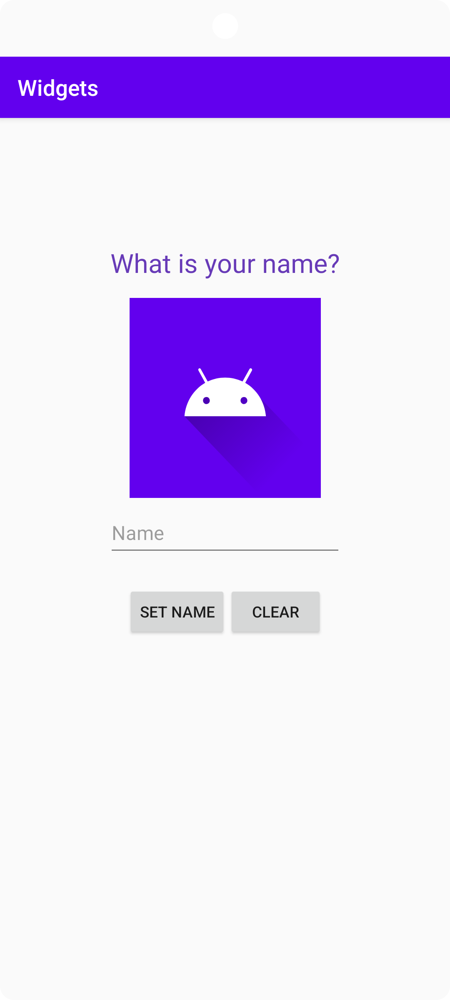
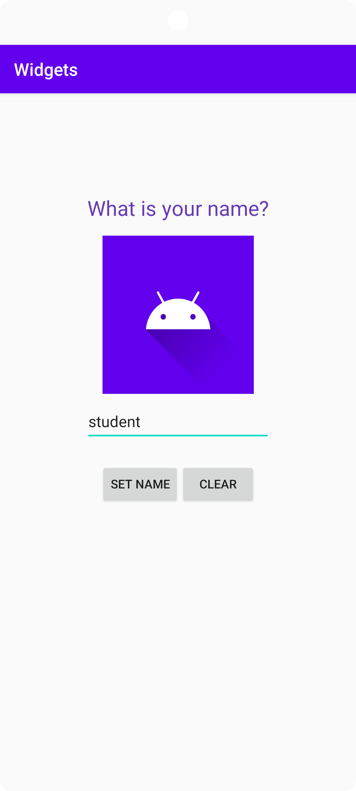
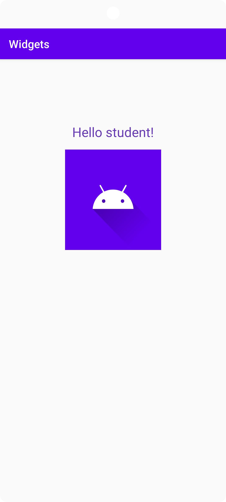

# Rapport

Forked the project and added a new string in string.xml to use as text value in an existing textView component.
The textView component is then constrained using constraintlayout to each side of the components parent with their matching side
(that is, left of TextView to left of parent, right of TextView to right of parent, and so on...). See code below:
```
    app:layout_constraintBottom_toBottomOf="parent"
    app:layout_constraintHorizontal_bias="0.5"
    app:layout_constraintLeft_toLeftOf="parent"
    app:layout_constraintRight_toRightOf="parent"
    app:layout_constraintTop_toTopOf="parent"
    app:layout_constraintVertical_bias="0.15"
```
The component also has a 0.15 bias to place the component closer to the beginning of the constraint, vertically (vertical bias).

Added an imageView to activity_main.xml and again added a string in strings.xml to use as a description.
ImageView is also constrained using constraintlayout. It has a 16dp space between itself and TextView using marginTop,
on the left and right sides the component is constrained to the sides of TextView as well.
Similarly, the rest of the components added also have constraintlayout and are constrained in the same way as ImageView,
editText component is constrained to be 8dp below ImageView,
left side of editName is constrained to left of ImageView and right side of editName to right of ImageView.
This gives the effect of editName always being below and center-aligned to ImageView.

Added buttons to activity_main.xml and added more strings in strings.xml to use as values for the buttons.

The two buttons (buttonYes and buttonNo) are also chained together to have them act as not just a pair of buttons, but more like one entity together.
The constraints are horizontal with a chain style of "packed".
buttonYes and buttonNo are constrained to left and right side of editName, whilst top is constrained to 24dp of editName's bottom.

Added buildFeatures in build.gradle (:app) to make it easier to work with views and changed (R.layout.activity_main); to (binding.getRoot());
as it generates a binding class that contain direct references to views with an ID, through code below:
```
buildFeatures {
        viewBinding true
    }
```

Created a custom OnClickListener class called MyListener.java with a binding parameter and using ActivityMainBinding called 'binding' as an argument to make different things happen based on what button was clicked with the help of a switch,
    if buttonYes is clicked, the user's input to EditText component will be saved and shown to the user along with a "Hello",
    if buttonNo is clicked, the input in EditText component will cleared.
The binding parameter is again to just make it easier to write code that will interact with components.
See code below:

```
    case R.id.buttonNo:
        if (input.getText().toString().equals("")) {
            System.out.println("Already blank");
            return;
        }
        binding.editName.getText().clear();
        System.out.println("Cleared EditText component");
        break;
    case R.id.buttonYes:
        if (input.getText().toString().equals("")) {
            System.out.println("Not allowed: Input is blank.");
            return;
        }
        binding.textView.setText("Hello " + input.getText().toString() + "!");
        binding.editName.setVisibility(View.GONE);
        binding.buttonYes.setVisibility(View.GONE);
        binding.buttonNo.setVisibility(View.GONE);
        System.out.println("Name is set.");
        break;
```
Finally, descriptive messages for events that "should" happen when buttons are clicked is added to make life easier when debugging and to make sure a particular line of code is actually running.

What it looks like when the app is launched:



What it looks like when a user inputs text:



And lastly, what it looks like when the input is saved:
